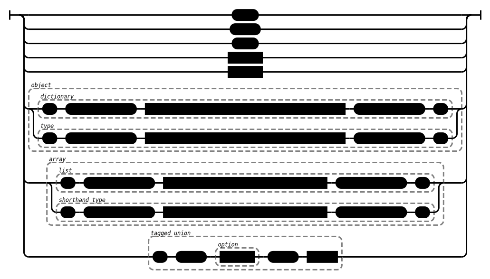
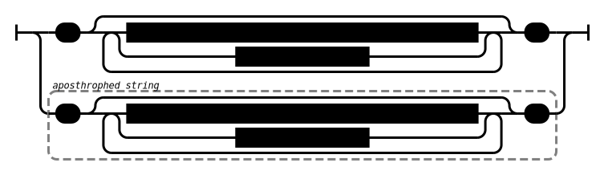
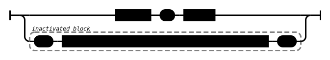
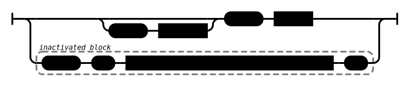

# ASTN

## Introduction

## Rationale


the parser supports the following additional (to JSON) features

* optional commas - No comma's are required. Rationale: When manually editing documents, keeping track of the comma's is cumbersome. With this option this is no longer an issue
* trailing commas - Allows commas before the `}` or the `]`. Rationale: for serializers it is easier to write a comma for every property/element instead of keeping a state that tracks if a property/element is the first one.
* comments - Allows both line comments `//` and block comments `/* */`. Rationale: when using JSON-like documents for editing, it is often useful to add comments
* apostrophes instead of quotation marks - Allows `'` in place of `"`. Rationale: In an editor this is less intrusive (although only slightly)
* angle brackets instead of brackets - Allows `<` and `>` in place of `[` and `]`. Rationale: a semantic distinction can be made between fixed length arrays (`ArrayType`) and variable length arrays (`lists`)
* parens instead of braces - Allows `(` and `)` in place of `{` and `}`. Rationale: a semantic distinction can be made between objctes with known properties (`Type`) and objects with dynamic keys (`dictionary`)
* schema - The document may start with a `!` followed by a value (`object`, `string` etc), followed by an optional `#` (indicating `compact`).
  * * The schema value can be used by a processor for schema validation. For example a string can indicate a URL of the schema.
  * * `compact` is an indicator for a processor (code that uses `bass-clarinet`'s API) that the data is `compact`. `base-clarinet` only sends the `compact` flag but does not change any other behaviour. Rationale: If a schema is known, the keys of a  `Type` are known at design time. these types can therefor be converted to `ArrayTypes` and thus omit the keys without losing information. This trades in readability in favor of size. This option indicates that this happened in this document. The file can only be properly interpreted by a processor in combination with the schema.
* tagged unions - This allows an extra value type that is not present in JSON but is very useful. tagged unions are also known as sum types or choices, see [taggedunion]. The notation is a pipe, followed by a string, followed by any other value. eg:  ```| "the chosen option" { "my data": "foo" }```. The same information can ofcourse also be written in strict JSON with an array with 2 elements of which the first element is a string.

## types

### document


### value



### number


### string



### escaped-character


### array-of-key-value-pairs-and-inactivated-blocks


### key-value-pair-or-inactivated-block



### array-of-values-and-inactivated-blocks


### value-or-inactivated-block


## Freeform vs Canonical form