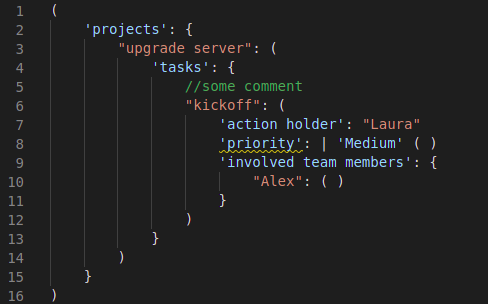

# Introduction

ASTN is a lightweight, text-based, language-independent generic syntax for editing data.
ASTN is short for Abstract Syntax Tree Notation and is pronounced Aston(æstən).

It is heavily based on [JSON](https://www.ecma-international.org/publications-and-standards/standards/ecma-404/). In fact, it is a superset of JSON, meaning that every JSON text is a valid ASTN text.

If you find JSON a useful format for its intended use, namely data interchange, but not completely fitting for data editing, you might find ASTN useful.
ASTN is designed to stay as close as possible to JSON and only add the features that are considered indispensible for data editing.

One of the most compelling benefits of ASTN is that syntax highlighting becomes much more useful.

# Example



# Changes to JSON
ASTN has the following changes to JSON:


## Schema support

ASTN is designed to maximally support editing of texts that must conform to a schema. ASTN does not specify how schemas work, but includes the fundamental concepts to make maximal use these concepts.
When editing data that conforms to a predefined schema the editor is bound by the schema rules in some places (metadata) and free in other places (instance data). This distinction is supported by the follwing features

* **aposthrope support** - ASTN allows strings to be wrapped between `'` in addition to `"`. Rationale: This makes it possible to differentiate between strings that represent fixed strings (strings that cannot randomly be chosen by the editor of the text) vs variable strings (to be chosen by the editor). For example `'name': "Alex"` where `name` is fixed, and the `Alex` is variable.

* **`type` support**. `types` are syntactically identical to `objects`, except for the surrounding tokens, instead of  `{` and `}`, they use `(` (U+0028) and `)` (U+0029). Rationale: a semantic distinction can be made between collections with keys determined by a schema (`types`) and collections with keys that can be chosen by the editor (`objects`). For example: `( 'name': "Alex", 'age': 10 )` vs `{ "Alex": 5, "Jack": 8 }`

* **`array type` support**. `array types` are identical to `arrays` in the same way that `types` are identical to `objects`. In this case, instead of the `[` and `]` as surrounding tokes, `<` (U+003C) and `>` (U+003E) are used. Rationale: a semantic distinction can be made between lists whose elements are determined by a schema (`array types`) and lists whose elements are determined by the editor (`arrays`).
For example: a schema might require 3 values; name, age and vaccinated. This can be written as follows:  `<"Alex", 10, true>`. Adding a 4th element will lead to a validation error.

* **a text can start with a header specifying the schema**. The header specifies the schema to which the text should conform. There are 2 options:

  * A reference to an extenal schema, indicated by an exclamation mark (U+0021), followed by a string. For example: `! "myorg/myschema1.0"`
  * An internal schema. The schema is embedded in the text. This is useful when you want to guarantee that a text will forever have its schema available. This is indicated by a double exclamation mark, followed by a string specifying a schema schema and then followed  a value. For example: `! ! "myorg/myschemaschema1.0" ...a value that represents the schema...`. The schema schema specifies to which the following (internal) schema should conform. This internal schema can then be used to validate the body that follows.


## Tagged Union support
Tagged unions allow the editor to select a option out of an list of options defined in a schema and based on that option fill in the additional data that is required for that option.
Tagged unions are getting more and more common in programming languages. For data languages, they are very useful as well. For a thorough explanation, please read the [wikipedia page](https://en.wikipedia.org/wiki/Tagged_union).
In ASTN a tagged union is written by a a vertical bar (U+007C), followed by a string, followed by a value.

For example; if in a text a 'mode of transport' has to be selected, which can either be 'bicycle' or 'car', but in the latter case, a 'fuel type' is required, this can be represented as follows: `'mode of transport': | 'bicycle' ()` and `'mode of transport': | 'car' ( 'fuel type': "gas" )`


## Optional and Permissive Comma Use
* commas are optional. Rationale: When manually editing texts, keeping track of the commas is cumbersome.
* trailing commas are allowed. In JSON, commas are only allowed as separators **between** key-value pairs in objects and **between** values in arrays. Trailing commas are not permitted. In ASTN, wherever a comma can be used as a separator, it can also be present at the end. Rationale: making sure the last entry does not have a comma when the rest has is cumbersome.

## Multiline string support
In JSON, control characters are not allowed in strings, so a string is confined to a single line. In some cases, this is limiting.
Therefor ASTN supports strings that span multiple lines. These strings are enclosed with a ` (backtick, U+0060).
These strings can contain horizontal tabs, carriage returns and line feeds.
These multiline strings are indentation aware. This means that an ASTN processors should reformat the string before further processing.

Example:
````
{
    'content': `this is a
    string that spans multiple lines.
    Indentation before each line should be ignored up to the point where the first line started.
     So, in the resulting string, the 3 lines above should have no indentation and this line should have an indentation of 1 space`
}
````

Reformatting should be done according to the following rules:

* A line break in an ASTN text is defined as follows:
  * a carriage return followed by a line feed (\r\n)
  * a line feed (\n)
  * a carriage return not followed by a line feed (\r)
* A string line is defined as follows:
  * the array of code points starting after the start token ` up to the first line break in the string
  * the array of code points between 2 line breaks within the string
  * the array of code points after the last line break in the string up to the end token `
* For an indented string, a reference indentation is determined as follows: The block of tabs and spaces following the preceding linebreak in the ASTN text that is not within another string. If there is no preceding linebreak, the reference indentation is an empty array of tabs and spaces
* For every string line in an indented string do the following: If the string line starts with the reference indentation, strip this part of the line

A string line in an indented string that does not start with the reference indentation is considered valid, but will not be reformatted.

## Comment support


# Types
[railroad diagrams](./railroads.html)

# Canonical form
ASTN texts can conform to a cannonical form, but are not required to.
A cannonical form prescribes the part of the syntax of a text that is considered to have no semantic relevance, specifically:
* string wrapping
* code point representation within strings.
* whitespace
* key ordering

ASTN Generators should generate ASTN texts that conform to the canonical form.
## string wrapping
In ASTN, there are 3 flavors of string wrapping: `"`, `'` and `\``.
The following table shows what the canonical form is for each possible occurence of a string:

type | canonical form
--|--
reference to external schema | "
reference to external schema schema | "
keys in objects | "
keys in types | '
the option in a tagged union | '
values | " or `

## code point representation within strings
if the code point is a ", a ' or a ` and not within a string wrapped in the same code point, it should not be escaped

1 For example: this is not correct: `"a quote: \""` and should be: `"a quote: ""`

2 If a code point is one of the other escaped characters, it should be written in the shorthand escaped form, for example: `"\n"`

3 If a code point has a regular representation, it should be used: This is not correct: `"\u0041"`, it should be: `"A"`

4 all other code points should be with the 6 digit \uxxxx representation

## whitespace
The canonical use of whitespace is described in the railroad diagrams. There are 3 options:
name | whitespace allowed | canonical form
--|--|--
ws:ss | yes | single space
ws:n | yes | no whitespace
ws:nl | yes | newline and proper indentation

The indentation level is incremented at the `ws:indentation+` locations and decremented at the  `ws:indentation-` locations


## key ordering
keys in objects and types should be ordered according to a binary comparison of their unicode representation. This means that ordering is case sensitive. This might be a drawback while editing a text but this is by design. The alternative has an even bigger drawback: a very complex and arbitrary collation algorithm that needs to be specified and implemented by all generators.

# FAQ
## Why not use an existing syntax
Existing syntaxes are not a strict superset of JSON, do not provide all the features that are required for the schema integration that was the design goal for ASTN (Especially the tagged union is not widely available) and/or provide way more features than that are required for the design goals of ASTN.
We looked at the following syntaxes:
* CSV
* TOML
* XML
* YAML
* JSON5
