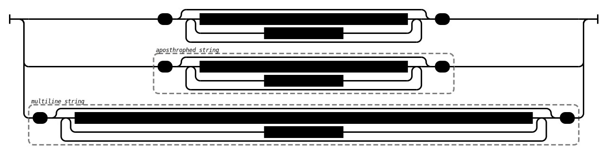

# astn.io

## document

## value

## number

## string

## escaped-character

## array-of-key-value-pairs-and-inactivated-blocks

## key-value-pair-or-inactivated-block

## array-of-values-and-inactivated-blocks

## value-or-inactivated-block
